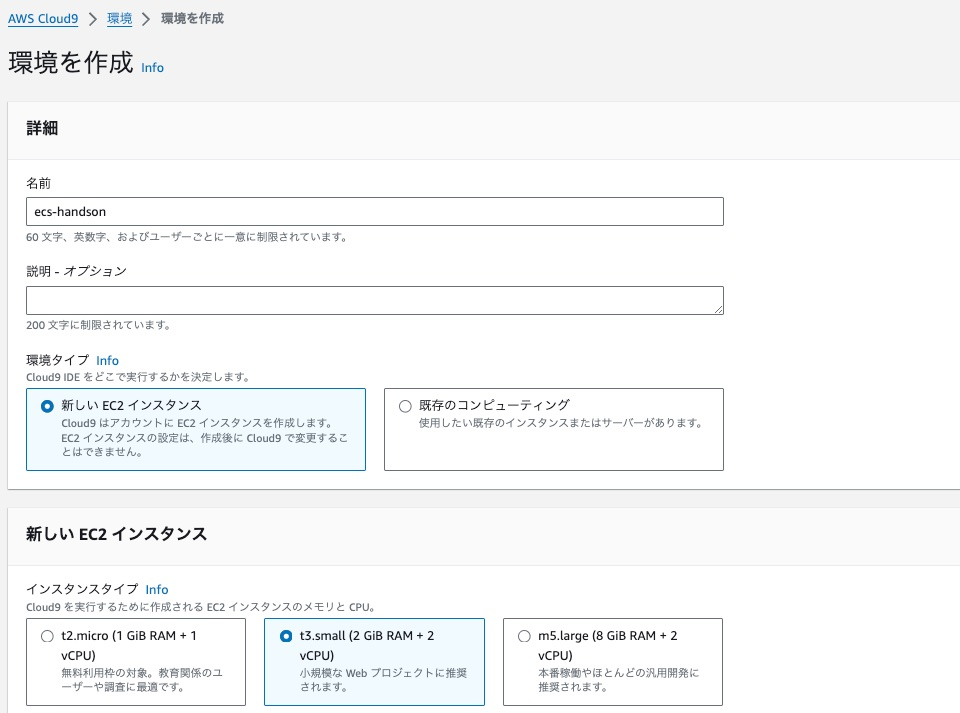
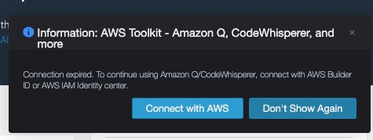
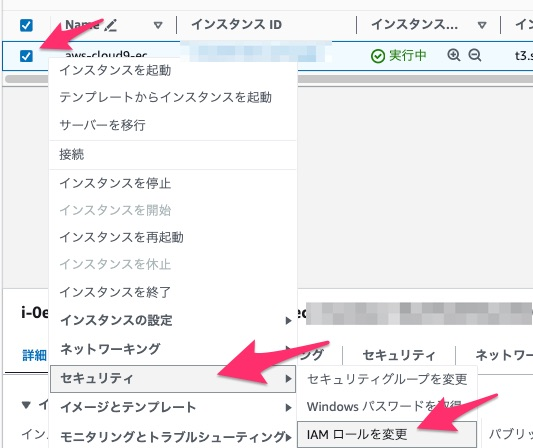
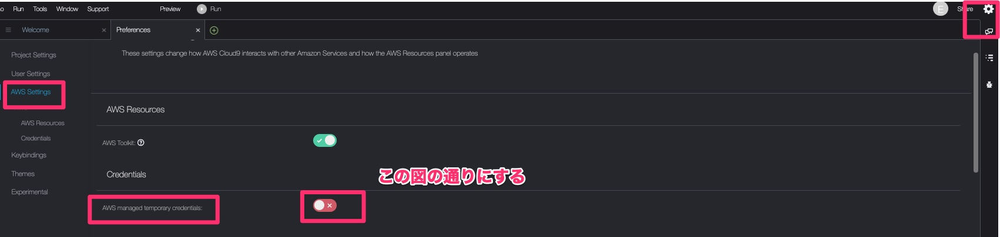
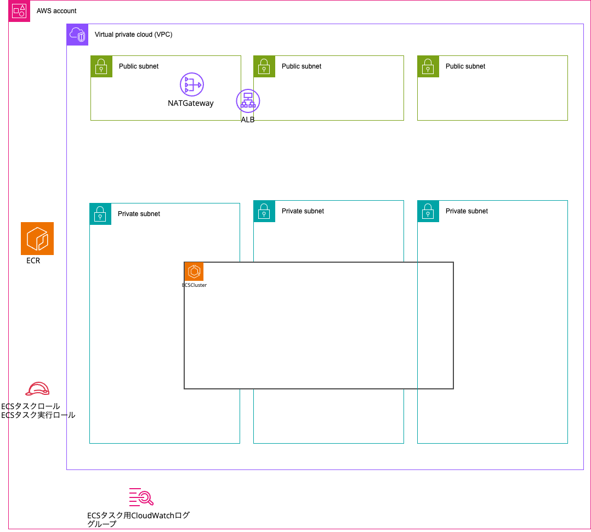
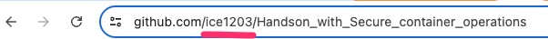

# 開発環境のセットアップ

## AWS アカウントへのログイン

AWS アカウント情報は以下のスプレッドシートにて配布しています。

https://docs.google.com/spreadsheets/d/1PH3YkIAy3QfTH3bFcVEdG7FAWdhCrtppQQFnlIrhWf8/edit?usp=sharing

## Cloud9環境の作成
AWSマネージメントコンソールにログインしたら、以下のURLをクリックしてCloud9を作成してください。

https://ap-northeast-1.console.aws.amazon.com/cloud9/home?region=ap-northeast-1

1. *環境を作成* を選択
2. *ecs-handson* という名前にします
3. インスタンスタイプを *t3.small* に変更します
    1. 
4. ネットワーク設定の箇所にある *VPC設定* をクリックして展開します
5. Amazon 仮想プライベートクラウド (VPC)の欄で、 *ecs-handson-c9-vpc* という名前のVPCを選択します
6. サブネットの欄で、 *ecs-handson-c9-vpc-public-ap-northeast-1c* という名前のサブネットを選択します
7. 作成ボタンをクリックします
8. しばらくしてから、Cloud9 IDE列の *開く* をクリックしてCloud9を開きます
9.  「Information: AWS Toolkit - Amazon Q,Codewhisperer, and more」というウィンドウが表示されたら、 *Don't Show Again* をクリックします
    1.  
10. 以下のURLをクリックしてCloud9のEC2インスタンスを選択します
    1.  https://console.aws.amazon.com/ec2/v2/home?#Instances:tag:Name=aws-cloud9-ecs-handson;sort=desc:launchTime
11. インスタンスを選択してから右クリックをし、*セキュリティ/IAMロールの変更* を選択します。
    1.  
12. IAMロールのドロップダウンから *ecs-handson-cloud9* を選択し、IAMロールの更新を選択します。

## Cloud9のセットアップ

1. Cloud9のターミナル画面に戻ります
2. Cloud9の設定画面を開き、*AWS Settings/Credentials/AWS Managed temporary credentials* を無効（赤い☓マーク）にします
    1. 
3. 環境変数を設定し、読み込ませます
    1. ```
        echo "export AWS_DEFAULT_REGION=ap-northeast-1" >> ~/.bashrc
        echo "export AWS_REGION=ap-northeast-1" >> ~/.bashrc
        echo "export AWS_ACCOUNT_ID=$(aws sts get-caller-identity --query Account --output text)" >> ~/.bashrc
        source ~/.bashrc
        # 環境変数が読み込まれたことを確認
        test -n "$AWS_REGION" && echo AWS_REGION is "$AWS_REGION" || echo AWS_REGION is not set
4. bash_profile及び、AWS CLIにもセッティングします
    1. ```
        echo "export AWS_ACCOUNT_ID=${AWS_ACCOUNT_ID}" | tee -a ~/.bash_profile
        echo "export AWS_REGION=${AWS_REGION}" | tee -a ~/.bash_profile
        aws configure set default.region ${AWS_REGION}
        # 確認
        aws configure get default.region
5. IAMロールが正しく設定されていることを確認します
    1. `aws sts get-caller-identity --query Arn | grep ecs-handson-cloud9 -q && echo "IAM role valid" || echo "IAM role NOT valid"`
    2. `IAM role NOT valid` と出力された場合は、続行せずにハンズオン担当を呼んでください
6. 以下のスクリプトを実行し、ディスクサイズを増やします
    1. ```
       pip3 install --user --upgrade boto3
       export instance_id=$(aws sts get-caller-identity --query Arn --output text | cut -d '/' -f3)
       python3 -c "
       import boto3
       import os
       from botocore.exceptions import ClientError
       ec2 = boto3.client('ec2')
       volume_info = ec2.describe_volumes(
           Filters=[
               {
                   'Name': 'attachment.instance-id',
                   'Values': [
                       os.getenv('instance_id')
                   ]
               }
           ]
       )
       volume_id = volume_info['Volumes'][0]['VolumeId']
       try:
           resize = ec2.modify_volume(
                   VolumeId=volume_id,
                   Size=31
           )
           print(resize)
       except ClientError as e:
           if e.response['Error']['Code'] == 'InvalidParameterValue':
               print('ERROR MESSAGE: {}'.format(e))"
       if [ $? -eq 0 ]; then
           sudo reboot
       fi
7. コマンドが成功するとCloud9のインスタンスが再起動されます。再度立ち上がってくるまでしばらくお待ちください

## 必要なツールやリポジトリのクローン

Cloud9が起動してきたら、以下のコマンドでこのあと使用するツールをインストールします

```
# tfenvインストール
git clone https://github.com/tfutils/tfenv.git ~/.tfenv
sudo ln -s ~/.tfenv/bin/* /usr/local/bin
# tfenvインストール確認
tfenv -v
```

## ECS初回デプロイ

Terraformによる初回デプロイを行うためにリポジトリをcloneしてきます

```
# 本リポジトリをclone
git clone https://github.com/ice1203/Handson_with_Secure_container_operations.git
```

`terraform/environments/dev/main.tf`を見てみます。
Terraformが作るAWSリソースは以下の通りです。



ECSサービスやECSタスク定義はTerraformの中では作成されない点を覚えておいてください。

またこのタイミングで `githubactions_role` モジュール内にある `github_owner`の値をご自身のGitHubIDに変更します。
GitHubIDはブラウザでご自身のGitHubで適当なリポジトリを開いたときのURLの以下の部分になります。



・terraform/environments/common/main.tf
```
module "githubactions_role" {
  source = "./modules/github-actions"

  sys_name       = local.sys_name
  env_name       = local.env_name
  github_owner   = "ice1203" ←ここを変更
  github_repo    = "Handson_with_Secure_container_operations"
  aws_account_id = local.aws_account_id

}
```

それではTerraformで上記のAWSリソースを作成します。

```
# commonのterraform apply（commonでは共通で使用するgithub actions用ロールを作成）
cd Handson_with_Secure_container_operations/terraform/environments/common/
# terraform インストール
tfenv install
terraform init -backend-config="bucket=tmp-hands-on-tf-state-$(aws sts get-caller-identity --query Account --output text)"
terraform plan
terraform apply

# devのterraform apply
cd ../dev/
# terraform インストール
tfenv install
terraform init -backend-config="bucket=tmp-hands-on-tf-state-$(aws sts get-caller-identity --query Account --output text)"
terraform plan
terraform apply
```

作成できたら、ご自身のGitHubリポジトリにpushしましょう

1. まず「Handson_with_Secure_container_operations」という名前のリポジトリをご自身のGitHubアカウント上で作成してください。
2. 以下のコマンドを実行してください
    1. ```
        git remote add myrepo https://github.com/<ご自身のGitHubID>/Handson_with_Secure_container_operations.git
        # リポジトリ追加されたことを確認
        git remote -v
        # push
        git push myrepo main

[Next: GitHub Actionsを使ったインフラのCI/CD](../module3/module3.md)
