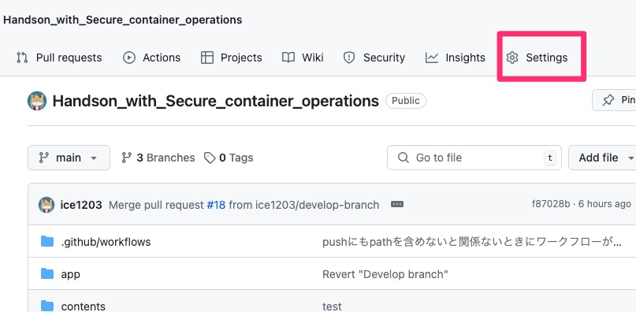
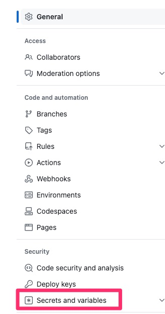
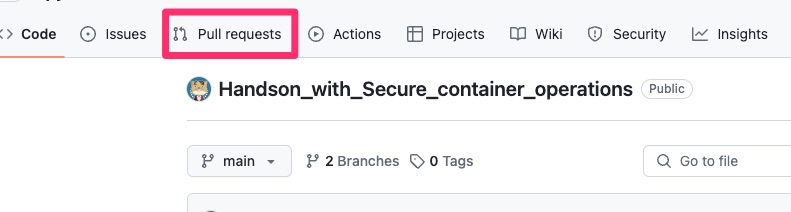
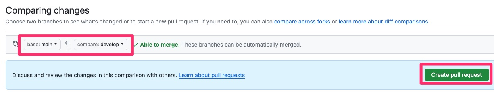
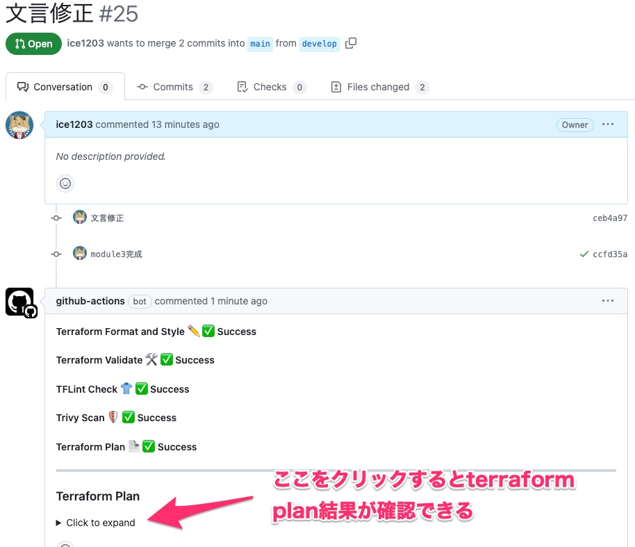
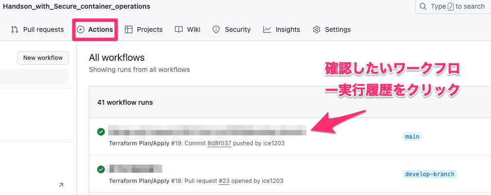
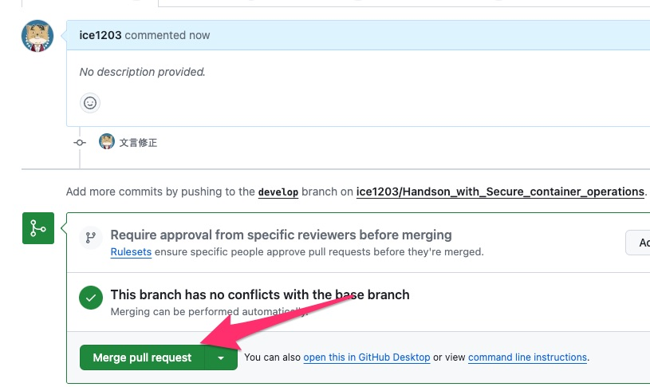

# GitHub Actionsを使ったインフラのCI/CD

このモジュールでは以下のことを行います。

- インフラCI/CDのためのワークフローの概要
- インフラCI/CDの中で使用するツールの紹介
- インフラCI処理の実施
- 検出された脆弱性の修正
- 修正後の再デプロイ

## インフラCI/CDのためのワークフローの概要

### インフラCI/CDのためのGitHub Actionsワークフローの概要

CI処理には以下のワークフローファイルを使用します。

- contents/module3/tf-plan-apply.yaml

`contents/module3/tf-plan-apply.yaml`を見てみます。


- トリガーについて

    ```
    on:
        push:
        branches:
            - main
        pull_request:
        branches:
            - main
        types:
            - opened
            - synchronize
            - reopened
    ```

    - pushとプルリクエストをトリガーとしている
    - プルリクエストは対象ブランチへのプルリクエストがトリガーになる
        - mainブランチにワークフローファイルがなくてもちゃんと起動
        - あくまでも対象ブランチへのプルリクエストがトリガーなので例えば上記だとdevelopブランチにプルリクエストを出しても起動しない


- terraform planの結果のアウトプット

    ```
    jobs:
        terraform-plan:
        name: 'Terraform Plan'
        runs-on: ubuntu-latest
        outputs:
            tfplanExitCode: ${{ steps.tf-plan.outputs.exitcode }}

    ```

    - ↑の塊がジョブ自体の定義になる
    - ここでのoutputsはジョブとしての出力を定義している（ステップにもoutputsは使える）
    - **tfplanExitCodeという出力を定義している。このあと実行されるtf-planというステップのexitcodeが格納される**
    - **tfplanExitCodeの結果をもとに別ジョブで定義されているterraform applyを実行するかどうかを決めることになる**

- terraformバージョン指定

    ```
        - name: Get Terraform Version
            id: tf-version
            run: |
            echo "TERRAFORM_VERSION=$(cat .terraform-version)" >> $GITHUB_OUTPUT

        - name: Setup Terraform
            uses: hashicorp/setup-terraform@v3
            with:
            terraform_version: ${{ steps.tf-version.outputs.TERRAFORM_VERSION }}
            terraform_wrapper: false
    ```

    - terraformバージョンを.terraform-versionから取得してGITHUB_OUTPUTという特殊ファイルに入れてる
    - GITHUB_OUTPUTに入れると、steps.step_id.outputs.変数名で別のステップで使用できる
    - terraform_wrapperとは
        - GitHubActions用のwrapperらしく、これを有効化すると`terraform`を実行するときに`STDOUT`や`STDERR`等を後続ジョブで使用できたりする
        - が、これが有効だとネイティブなterraformコマンドにならないので、例えばvalidateとかがうまくいかないらしい
            - https://qiita.com/ishii1648/items/5c9c4c5996bc7ac00317
    - GITHUB_OUTPUTはステップ間の情報のやり取りのほか、ジョブ間でのやりとりにも使われる

        ```
        jobs:
            job1:
            runs-on: ubuntu-latest
            # Map a step output to a job output
            outputs:
                output1: ${{ steps.step1.outputs.test }}
                output2: ${{ steps.step2.outputs.test }}
            steps:
            - id: step1
                run: echo "test=hello" >> $GITHUB_OUTPUT
            - id: step2
                run: echo "test=world" >> $GITHUB_OUTPUT
            job2:
            runs-on: ubuntu-latest
            needs: job1
            steps:
            - run: echo ${{needs.job1.outputs.output1}} ${{needs.job1.outputs.output2}}
        ```

- terraform init
    - working-directoryでルートmain.tfがあるとこを指定して実行
- terraform fmt
    - -checkと-recursiveを使ってる
    - -checkは修正せずにあくまでチェックだけ、recursiveはサブディレクトリがある場合もまとめてfmt
        - https://qiita.com/takkii1010/items/082c0854fd41bc0b26c3#terraform-fmt--check
        - フォーマット済みでない場合は終了コード０以外になるのでここでワークフロー終了
- terraform validate
    - 構文チェック
        - https://developer.hashicorp.com/terraform/cli/commands/validate
- tflint

    ```
        - name: Setup TFLint
            uses: terraform-linters/setup-tflint@v4
            with:
            tflint_wrapper: true

        - name: Init TFLint
            run: |
            tflint --init

        - name: TFLint
            id: tflint
            run: |
            tflint --config=${{ github.workspace }}/.tflint.hcl --recursive

        - name: TFLint ExitCode Check
            id: tflint-exitcode-check
            run: |
            exit ${{ steps.tflint.outputs.exitcode }}

    ```

    - setup
        - tflint_wrapper：デフォルトfalse、tflint実行をラップしてstdout,stderr,exitcodeを公開する
    - init：awsプラグイン等のインストールのために必要
    - tflint実行：configをリポジトリ内の.tflint.hclを指定。recursiveで再帰的にチェック
    - exitcode check：exit ＜終了コード＞と書くことで終了コードが０以外のときにワークフローを終了させることになる。
        - 終了コードのところを、${{ steps.tflint.outputs.exitcode }} と記載することでtflint結果を取得できる

- trivy

    ```
        - name: Trivy Scan
            id: trivy-scan
            uses: aquasecurity/trivy-action@0.19.0
            with:
            scan-type: config
            exit-code: '1'
            severity: 'CRITICAL,HIGH'
            output: 'trivy-table'

    ```

    - trivyはセットアップなしでいきなり使える

- terraform plan

    ```
        - name: Terraform Plan
            id: tf-plan
            run: |
            export exitcode=0
            terraform plan -detailed-exitcode -no-color -out=tfplan || export exitcode=$?

            echo "exitcode=$exitcode" >> $GITHUB_OUTPUT

            if [ $exitcode -eq 1 ]; then
                echo Terraform Plan Failed!
                exit 1
            else
                exit 0
            fi
            working-directory: ${{ env.ROOT_MODULE_PATH }}
        - name: Publish Terraform Plan
            uses: actions/upload-artifact@v4
            with:
            name: tfplan
            path: ${{ env.ROOT_MODULE_PATH }}/tfplan
    ```

    - **`terraform plan`** コマンドを実行します。
        - **`detailed-exitcode`** オプションは、Terraformの終了コードを詳細に返します。具体的には、変更がない場合は **`0`**、エラーが発生した場合は **`1`**、変更がある場合は **`2`** を返します。
        - **`no-color`** オプションは、出力に色を付けないようにします。これにより、ログが読みやすくなります。
        - **`out=tfplan`** オプションは、計画の結果を **`tfplan`** ファイルに保存します。
    - detailed-exitcodeによって終了コードが上記のようになるのでifで条件分岐
        - 1ならエラーなのでワークフロー終了
        - それ以外は正常終了
        - exitcodeはGITHUB_OUTPUT経由で別ジョブにわたす
    - -outでtfplanを出力している理由は２つある
        - １つは同ジョブの中で出力させるため
        - １つはapply時にtfplanファイルを元にapplyさせるため
            - なのでupload-artifactしてる
- 実行結果のまとめ

    ```
        - name: Create String Output
            if: always()
            id: string-output
            run: |
            function get_result() {
                if [ "$1" = "success" ]; then
                echo ':white_check_mark: **Success**'
                elif [ "$1" = "failure" ]; then
                echo ':x: **Failed**'
                elif [ "$1" = "skipped" ]; then
                echo ':fast_forward: **Skipped**'
                elif [ "$1" = "cancelled" ]; then
                echo ':no_entry: **Cancelled**'
                else
                echo ':question: **Unknown**'
                fi
            }

            if [ "${{ steps.tf-plan.outcome}}" = "success" ]; then
                pushd ${{ env.ROOT_MODULE_PATH }}
                TERRAFORM_PLAN=$(terraform show -no-color tfplan)
                popd
            fi

            delimiter="$(openssl rand -hex 8)"
            echo "summary<<${delimiter}" >> $GITHUB_OUTPUT
            echo "#### Terraform Format and Style :pencil2: $(get_result ${{ steps.tf-fmt.outcome }})" >> $GITHUB_OUTPUT
            echo "#### Terraform Validate :hammer_and_wrench: $(get_result ${{ steps.tf-validate.outcome }})" >> $GITHUB_OUTPUT
            echo "#### TFLint Check :shirt: $(get_result ${{ steps.tflint-exitcode-check.outcome }})" >> $GITHUB_OUTPUT
            echo "#### Trivy Scan :shield: $(get_result ${{ steps.trivy-scan.outcome }})" >> $GITHUB_OUTPUT
            echo "#### Terraform Plan :page_facing_up: $(get_result ${{ steps.tf-plan.outcome }})" >> $GITHUB_OUTPUT

            echo "---" >> $GITHUB_OUTPUT

            if [ "${{ steps.tflint-exitcode-check.outcome }}" = "failure" ]; then
                echo "### TFLint Result" >> $GITHUB_OUTPUT
                echo "<details><summary>Click to expand</summary>" >> $GITHUB_OUTPUT
                echo "" >> $GITHUB_OUTPUT
                echo '```' >> $GITHUB_OUTPUT
                echo "${{ steps.tflint.outputs.stdout }}" >> $GITHUB_OUTPUT
                echo '```' >> $GITHUB_OUTPUT
                echo "</details>" >> $GITHUB_OUTPUT
            fi

            if [ "${{ steps.trivy-scan.outcome }}" = "failure" ]; then
                echo "### Trivy Scan Result" >> $GITHUB_OUTPUT
                echo "<details><summary>Click to expand</summary>" >> $GITHUB_OUTPUT
                echo "" >> $GITHUB_OUTPUT
                echo '```' >> $GITHUB_OUTPUT
                cat trivy-table >> $GITHUB_OUTPUT
                echo '```' >> $GITHUB_OUTPUT
                echo "</details>" >> $GITHUB_OUTPUT
            fi

            if [ "${{ steps.tf-plan.outcome}}" = "success" ]; then
                echo "### Terraform Plan" >> $GITHUB_OUTPUT
                echo "<details><summary>Click to expand</summary>" >> $GITHUB_OUTPUT
                echo "" >> $GITHUB_OUTPUT
                echo '```' >> $GITHUB_OUTPUT
                echo "$TERRAFORM_PLAN" >> $GITHUB_OUTPUT
                echo '```' >> $GITHUB_OUTPUT
                echo "</details>" >> $GITHUB_OUTPUT
            fi

            echo "${delimiter}" >> $GITHUB_OUTPUT

    ```

    - if: alwaysで他ステップが失敗してても常に実行
    - get_result関数でステップの結果を可読性よくしている
    - outcomeはGitHubActionsの要素でステップの実行結果がはいる。
        - https://docs.github.com/ja/actions/learn-github-actions/contexts#steps-context
        - `success`、`failure`、`cancelled`、および `skipped`
        - skippedは、if: "false”などifで条件判断の結果実行されないときがskipped
    - get_resultで各ステップの結果を整形している、整形後はGITHUB_OUTPUTへ出力
    - デリミタはヒアドキュメントの終了文字として使ってる
    - 最終的にsummary outputとして別ステップで使える
    - GITHUB_STEP_SUMMARYに入れるとワークフロー実行の概要ページに表示される
        - https://docs.github.com/ja/actions/using-workflows/workflow-commands-for-github-actions
    - Push Terraform Output to PRでプルリクにもコメント
- terraform applyがプルリクエストのタイミングで実行されないようにする仕組みについて
    1. **`github.ref == 'refs/heads/main'`**:
        - この条件は、現在のリファレンス（ブランチ）が **`main`** であることを確認します。
        - つまり、**`main`** ブランチに対するプッシュである場合にのみ、このジョブが実行されます。プルリクエストの場合、リファレンスは **`refs/pull/`** で始まるため、この条件を満たしません。

## インフラCI/CDの中で使用するツールの紹介

Terraformのワークフロー処理の中で使用されているツールを簡単にご紹介します。
これらのツールは自身の開発端末上でも使用することが出来、開発端末で使用することでよりTerraformコーディングを効率化することが出来ます

> [!TIP]
> 開発端末上でこれらのツールを使用する場合は、pre-commitというツールでコミット時に自動で実行するようにすると便利です  
> 公式ページ： https://pre-commit.com/  
> Terraform関連フック： https://github.com/antonbabenko/pre-commit-terraform

### tfenv

https://github.com/tfutils/tfenv

- Terraform バイナリのバージョン管理を行うツール
    - python における pyenv のようなツールです
- `.terraform-version` ファイルにバージョンを記述することで、引数無しで指定したバージョンの Terraform をインストールすることができる
    - このファイルを Git 管理することで、プロジェクト内の Terraform バージョンの共通化を行えます

### TFLint

https://github.com/terraform-linters/tflint

- Terraform コードのリンターツールです
- terraform validateやterraform planでは検知できないエラーを検知することができます
    - 例えばインスタンスタイプの誤りや命名規約違反等

### Trivy

https://github.com/aquasecurity/trivy

- 概要
    - 静的解析ツールでセキュリティ上の脆弱性を検出するOSS
        - 静的解析とはソースコード自体を解析することにより、プログラムを実行せずに問題を発見することを指します
    - IaCのセキュリティ上問題ある設定や機密情報が埋め込まれていることを検知することにより、セキュリティの問題を未然に防ぐことを目的としています
    - Terraformの他、CloudFormation、Dockerfile等にも対応しています

## インフラCI処理の実施

> [!TIP]
> 実際にプルリクエストをトリガーとしたワークフローを使う場合は、GitHubのブランチ保護ルールを併用することを推奨します。これによってワークフローが成功していないとマージが不可といったことを実現できます

1. GitHubリポジトリ側でワークフロー内で使用するsecretsの設定をしておきます
    1. ご自身のGitHubリポジトリ画面を開きます。以下のようなURLのはずです
        1. https://github.com/＜自身のGitHubID＞/Handson_with_Secure_container_operations
    2. Settingsを選択します
        1. 
    3. Secrets and variablesの「Actions」を選択します
        1. 
    4. *New repository secret* ボタンをクリックします
    5. Secretsに以下を登録します
        - Name: AWS_ACCOUNT_ID
        - Secret: <ハンズオンで使用しているAWSアカウントID>
2. GitHub ActionsのワークフローとしてGitHubに認識させるためにはリポジトリ内の所定のディレクトリに置く必要があります
    1. `contents/module3/tf-plan-apply.yaml`を `.github/workflows` ディレクトリに格納しましょう
        1. ```
            # ブランチの作成、切り替え
            git branch develop
            git checkout develop
            # ワークフローファイルの格納
            cd Handson_with_Secure_container_operations/contents/module3/
            git mv tf-plan-apply.yaml ../../.github/workflows/app
3. またこのワークフローでは `terraform` ディレクトリ配下のファイルの変更を検知してワークフローが起動するような設定になっています。そのため `terraform` ディレクトリ配下のファイルを編集します
    1. `terraform/modules/ecs/main.tf`を開き、107行目付近の以下の箇所のコメントアウトを外してください
        1. ```
            ingress {
                # ↓以下の行のコメントアウトを外す
                #description = "Allow traffic from ALB"
                security_groups = [aws_security_group.webapp_alb.id]
                from_port       = var.docker_container_port
4. 編集が完了したら、ファイルをGitHubリポジトリにpushします
    1. ```
        # コミットとpush
        git add --all
        git commit -m "add terraform workflow"
        git push myrepo develop
5. ワークフローファイルの追加ができたので実際に動かしてみます。ブラウザ上でdevelopブランチからmainブランチへのプルリクエストを出します
    1. 
6. *New pull request* ボタンをクリックします
7. developブランチからmainブランチへのプルリクエストであることを以下のように指定します
    1. 
8. *Create pull request* ボタンをクリックします
9. mainブランチへのプルリクエストをトリガーにワークフロー処理が動き始めたはずです。
    - しばらく待てばプルリクエストのコメントとして各ツールのチェック状況のサマリが表示されます。
        - 
    - またリポジトリ画面上部の *Actions* タブからも実行の様子が確認できます
        - 
10. プルリクエストをトリガーとした、CIのワークフロー処理が正常に完了したら、次はmainブランチにpushをすることで実際にAWS環境へのデプロイを行います
    1.  プルリクエストの画面に戻り、 *Merge pull request* ボタンをクリックします
        1.  
11. mainブランチへのマージをトリガーに再度、ワークフローが起動します
    1.  またリポジトリ画面上部の *Actions* タブからも実行の様子を確認してみましょう


## 検出された脆弱性の修正

1. ワークフローの結果、脆弱性が検出されたかと思いますので修正しましょう
    1. `resource "aws_security_group" "webapp_alb" ` のegress（アウトバウンド）が全開放になっています。ALBからのアウトバウンド通信は通常ターゲットへのヘルスチェック等のVPC内に限られるので、VPCのCIDRのみを許可するようにします
    2. `cidr_blocks = ["0.0.0.0/0"]` の行を削除して、138行目付近の `#cidr_blocks = var.alb_allowed_cidr_blocks` のコメントアウトを外します

## 修正後の再デプロイ

1. 上記の修正が完了したら、ファイルをGitHubリポジトリにpushします
    1. ```
        # コミットとpush
        git add --all
        git commit -m "fix terraform vulnerability"
        git push myrepo develop
2. 上記の手順に従いブラウザ上でdevelopブランチからmainブランチへのプルリクエストを出し、mainブランチへのマージをしてください
    1. ※ `Terraform plan` 結果を念の為、確認するようにしましょう


[Next: GitHub Actionsを使ったアプリケーションのデプロイ](../module4/module4.md)
