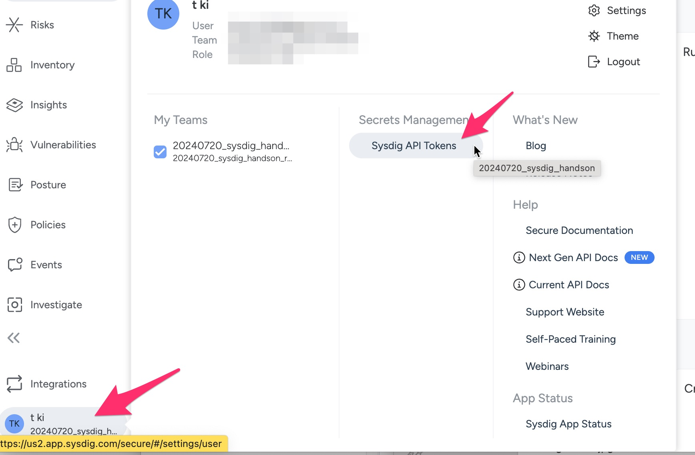
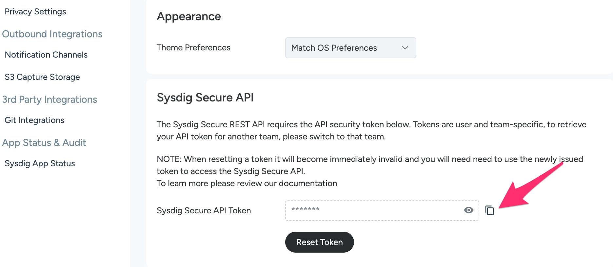
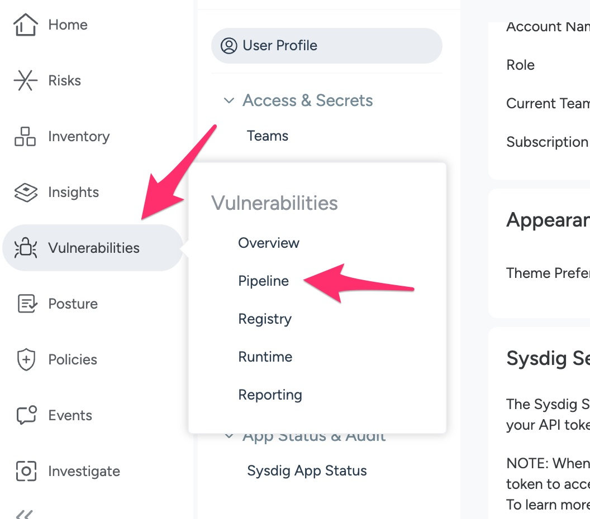
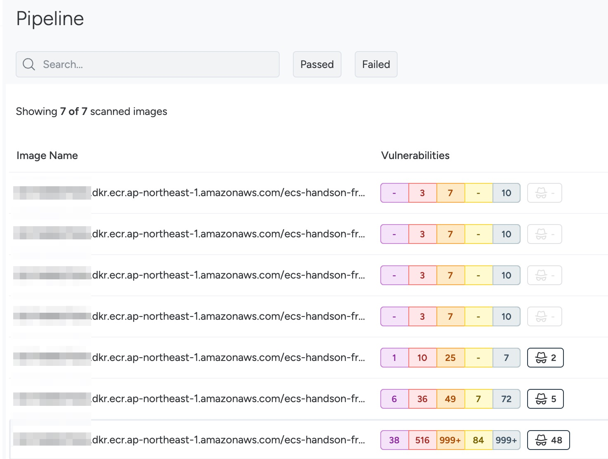
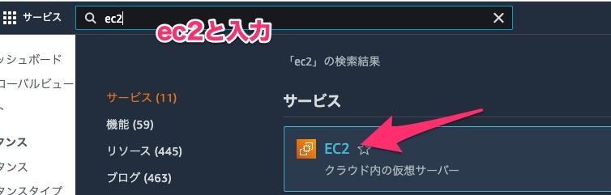
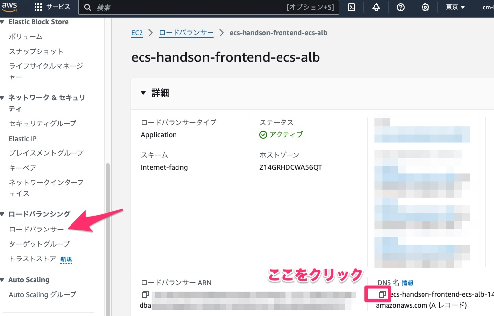

# GitHub Actionsを使ったアプリケーションのデプロイ

このモジュールでは以下のことを行います。

- プルリクエストをトリガーにコンテナ部分のCI処理（コンテナビルド確認、ビルドしたコンテナの脆弱性チェック、ecspressoによるverify）を実行
- プルリクエスト実施。検出された脆弱性の修正
- マージを実施して、デプロイ

## ecspressoについて

本ハンズオンではアプリケーションのデプロイにecspressoを使用しています。  
ecspressoはAmazon ECS専用のデプロイツールとなっており、ECSサービスとタスクに関わるリソースをコード管理し、デプロイを実行するためのものです。  

ECSサービスとタスクはTerraformでもデプロイできますが、これらのリソースはアプリケーションの更新とともに変更される必要がある性質のものであるため、ALBやIAMロールといったリソースとともにTerraformで管理してしまうと本来は影響を及ぼしたくない部分まで、一緒にデプロイすることになってしまいます。  

また、アプリケーションとインフラはそれぞれ別のチームが担当していることも多く、仮にTerraformだけで全てを管理しておりTerraformの管理をインフラチームで行っている場合、アプリケーション更新のたびにインフラチームに依頼をすることになってしまいアプリケーションの改善ライフサイクルに影響が出てしまうことが想像できます。

ecspressoはアプリケーションと同じリポジトリでECSサービスやタスク定義の設定を管理することで上記のような問題を解決するツールになっています。


## アプリケーションのCI/CD処理の概要

CI/CD処理には以下のワークフローファイルを使用します。

- CI: contents/module4/container-ci.yaml
- CD: contents/module4/app-cd.yaml

- `contents/module4/container-ci.yaml` では以下のような処理を行っています。
    1. ECRへのログイン
    2. Sysdig CLIスキャナーのダウンロード
    3. コンテナイメージのビルドとSysdig CLIスキャナーを使ったコンテナイメージスキャン
    4. コンテナイメージをECRにpush
    5. ecspressoをインストールしてECSデプロイするための構成が正しいことを検証
    6. ECRにpushしたコンテナイメージを削除
- `contents/module4/app-cd.yaml` では以下のような処理を行っています。
    1. ECRへのログイン
    2. コンテナイメージのビルドとECRにpush
    3. ecspressoをインストールしてECSデプロイするための構成が正しいことを検証
    4. ecspressoによるECSタスク定義及びECSサービスのデプロイ

> [!NOTE]
> 上記のワークフローの改善ポイントとして考えられるのは以下の通りです  
> - プルリクエスト時に作成したコンテナイメージをデプロイ時にも使用（実際にテストを行ったイメージで本番環境に展開することが出来ます）
> - デプロイ時にもコンテナイメージの脆弱性チェックを実施（プルリクエスト発行時からデプロイまでの間に脆弱性が新たに発生することもあります）mainブランチへマージ自体はされてしまいますが、本番環境への混入は防ぐことができます

## アプリケーションCI処理の実施

> [!TIP]
> 実際にプルリクエストをトリガーとしたワークフローを使う場合は、GitHubのブランチ保護ルールを併用することを推奨します。これによってワークフローが成功していないとマージが不可といったことを実現できます

### Sysdig Secure APIトークンの確認

1. Sysdig管理画面にログインします。ご用意頂いたメールアドレス宛にSysdig管理画面への招待メールをお送りしていますので、そちらからログインをお願いします
    1. Googleアカウントの場合、シングルサインオンで簡単にログインできます
2. Sysdig管理画面に入ったら以下のような画面が出るので画面下部の *Get Into Sysdig* ボタンをクリックします
    1. 
3. Home画面で以下のように画面下部の自ユーザ名をクリックし、 *Sysdig API Tokens* をクリックします
    1. 
4. Sysdig Secure API Tokenの欄の横にあるコピーボタンをクリックして、コピーした値をメモ帳などに控えておきます
    1. 

### コンテナCI処理の実行

1. GitHubリポジトリ側でワークフロー内で使用するsecretsの設定をしておきます
    1. ご自身のGitHubリポジトリ画面を開きます。以下のようなURLのはずです
        1. https://github.com/＜自身のGitHubユーザ名＞/Handson_with_Secure_container_operations
    2. Settingsを選択します
        1. 
    3. Secrets and variablesの「Actions」を選択します
        1. 
    4. *New repository secret* ボタンをクリックします
    5. Secretsに以下を登録します
        - Name: SYSDIG_SECURE_API_TOKEN
        - Secret: Sysdig管理画面で確認したSysdig Secure APIトークンの値
2. GitHub ActionsのワークフローとしてGitHubに認識させるためにはリポジトリ内の所定のディレクトリに置く必要があります
    1. `container-ci.yaml`と`app-cd.yaml`を `.github/workflows` ディレクトリに格納しましょう
        1. ```
            # developブランチであることを確認
            git branch
            # ワークフローファイルの格納
            cd ~/environment/Handson_with_Secure_container_operations/contents/module4/
            git mv container-ci.yaml ../../.github/workflows/
            git mv app-cd.yaml ../../.github/workflows/
3. またこのワークフローでは `app` ディレクトリ配下のファイルの変更を検知してワークフローが起動するような設定になっています。そのため `terraform` ディレクトリ配下のファイルを編集します
    1. `app/javascript-sample-app/index.js`を開き、21行目のコメントアウトされている箇所に適当な文字を記載してください
        1. ```
            // config 適当な文字列
4. 編集が完了したら、ファイルをGitHubリポジトリにpushします
    1. ```
        # コミットとpush
        git add --all
        git commit -m "add app workflow"
        git push myrepo develop
5. ワークフローファイルの追加ができたので実際に動かしてみます。ブラウザ上でdevelopブランチからmainブランチへのプルリクエストを出します
    1. 
6. *New pull request* ボタンをクリックします
7. developブランチからmainブランチへのプルリクエストであることを以下のように指定します
    1. 
8. *Create pull request* ボタンをクリックします
9. mainブランチへのプルリクエストをトリガーにワークフロー処理が動き始めたはずです。
    - またリポジトリ画面上部の *Actions* タブからも実行の様子が確認できます
        - 


### コンテナイメージ脆弱性の確認

1. ワークフロー処理は失敗したはずです。失敗した原因はコンテナイメージに脆弱性が含まれているからです
2. どのような脆弱性があるのかをSysdig管理画面から確認してみます
3. Sysdig管理画面に戻り、*Vulnerabilities/Pipeline* を選択します
    1. 
4. マウスオーバーするとコンテナイメージのタグが確認できるので、先程のCI処理の中でビルドしたコンテナイメージをクリックします（タグはdevelopブランチの最新のコミットIDになっています）
    1. 
5. 多くの脆弱性がコンテナイメージに含まれていることを確認できます

## 検出された脆弱性の修正

1. コンテナイメージの脆弱性をDockerコンテナのベースイメージを変更することで修正します
2. 以下のファイルをコピーし、再度リポジトリにpushします
    1. `Dockerfile`を `.app/javascript-sample-app` ディレクトリに格納しましょう
        1. ```
            # Dockerfileの格納
            cd ~/environment/Handson_with_Secure_container_operations/contents/module4/
            git mv -f Dockerfile ../../app/javascript-sample-app
            git add --all
            git commit -m "update dockerfile"
            git push myrepo develop
3. 既にdevelopブランチでプルリクエスト作成済であるところにpushをしたのでプルリクエストが更新されます。更新をトリガーにワークフローが起動します
4. ワークフローが完了したら、再度 *コンテナイメージ脆弱性の確認* と同様の手順で脆弱性の数がどの程度変わったか確認してみましょう

## AWS環境へのデプロイ

1. プルリクエストをトリガーとした、CIのワークフロー処理が正常に完了したら、次はmainブランチにpushをすることで実際にAWS環境へのデプロイを行います
    1.  プルリクエストの画面に戻り、 *Merge pull request* ボタンをクリックします
        1.  
2.  mainブランチへのマージをトリガーに再度、ワークフローが起動します
    1.  またリポジトリ画面上部の *Actions* タブからも実行の様子を確認してみましょう
3.  ALBの画面からALBのDNS名を確認し、確認したDNS名をブラウザに入力しアクセスしてみましょう
    1. 
    2. 
> [!NOTE]
> ここで確認したALBのDNS名は後ほどまた使うのでメモしておいてください


[Next: Sysdigによるランタイムモニタリングの導入](../module5/module5.md)
