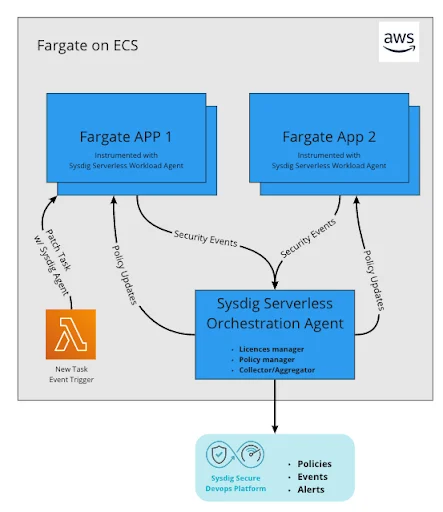
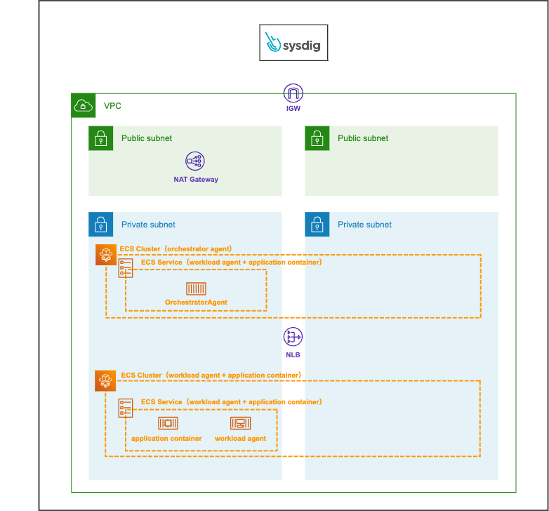
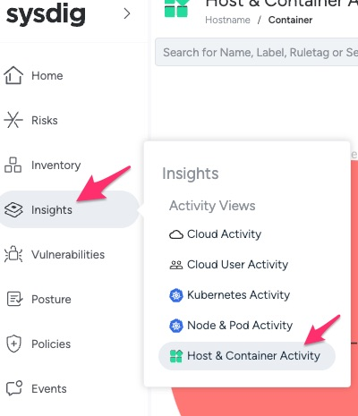
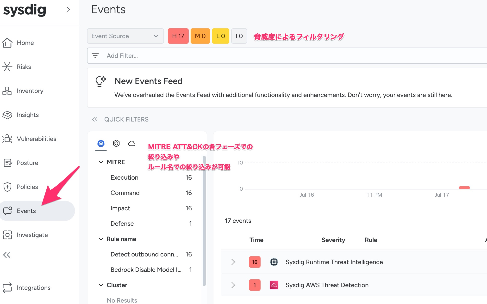

# Sysdigによるランタイムモニタリングの導入

このモジュールでは以下のことを行います。

- Orchestration AgentをTerraformで実装します
- Sysdig Workload エージェント用のサイドカーコンテナをタスク定義に含めます
- 実際にコンテナに対して攻撃をしてみます
- 攻撃内容をSysdig管理コンソールから確認します

## Sysdig Secureシステム概要

ECS FargateでSysdigを使用する場合、以下のような構成となります。  
- 業務アプリケーションコンテナにワークロードエージェントが配置
- ワークロードエージェントがOrchestration Agentと通信し、検知したセキュリティイベントを送信したり、ポリシーを受信したりする



AWS構成図として表すと以下のような形になります



<a href="https://dev.classmethod.jp/articles/sysdig-secure-ecs-fargate-setting-up-terraform-overview/">Serverless Agentsを利用してECS Fargate環境でSysdig Secureを利用してみた〜Terraform編〜 | DevelopersIOより</a>

## Sysdig Secure導入

### Orchestration AgentをTerraformで実装

それでは、Orchestration Agentを実装してみましょう

1. Orchestration Agentで使用するsecretsの設定をしておきます
    1. ご自身のGitHubリポジトリ画面を開きます。以下のようなURLのはずです
        1. https://github.com/＜自身のGitHubユーザ名＞/Handson_with_Secure_container_operations
    2. Settingsを選択します
        1. 
    3. Secrets and variablesの「Actions」を選択します
        1. 
    4. *New repository secret* ボタンをクリックします
    5. Secretsに以下を登録します
        - Name: SYSDIG_AGENT_ACCESS_KEY
        - Secret: <Chatにてお伝えします>
1. `.github/workflows/tf-plan-apply.yaml` の27行目付近の以下の行のコメントアウトを外します。※これはSysdig Orchestration Agent実装時に必要となるAgent Access Keyを変数に格納しています
    1. ```
        #TF_VAR_sysdig_agent_access_key: ${{ secrets.SYSDIG_AGENT_ACCESS_KEY }}
2. `terraform/environments/dev/main.tf` の以下の行のコメントアウトを外します。この部分でOrchestration Agentを定義しています
    1. ```
        #module "fargate-orchestrator-agent" {
        #  source  = "sysdiglabs/fargate-orchestrator-agent/aws"
        #  version = "0.4.1"
        #
        #  vpc_id  = module.vpc.vpc_id
        #  subnets = module.vpc.private_subnets
        #
        #  access_key = var.sysdig_agent_access_key
        #
        #  collector_host = "ingest-us2.app.sysdig.com"
        #  collector_port = "6443"
        #
        #  name        = "sysdig-orchestrator"
        #  agent_image = "quay.io/sysdig/orchestrator-agent:latest"
        #
        #  # True if the VPC uses an InternetGateway, false otherwise
        #  assign_public_ip = false
        #
        #  tags = {
        #    description = "Sysdig Serverless Agent Orchestrator"
        #  }
        #}
3. `terraform/environments/dev/variables.tf` の以下の行のコメントアウトを外します。環境変数で定義されたAgent Access Keyをこの変数で受け取ります
    1. ```
        #variable "sysdig_agent_access_key" {
        #  type        = string
        #  description = "Sysdig agent access key"
        #  sensitive   = true
        #
        #}
4. 編集が完了したら、ファイルをGitHubリポジトリにpushします
    1. ```
        # コミットとpush
        cd ~/environment/Handson_with_Secure_container_operations/terraform
        terraform fmt --recursive
        git add --all
        git commit -m "add Orchestration Agent"
        git push myrepo develop
5. [module4](../module4/module4.md) の手順に従いブラウザ上でdevelopブランチからmainブランチへのプルリクエストを出し、mainブランチへのマージをしてください
    1. ※ `Terraform plan` 結果を念の為、確認するようにしましょう
6. mainブランチへのマージができたらOrchestration Agentのデプロイは完了です

### Sysdig Workload エージェントのデプロイ

続いて、アプリケーションにSysdig Workload エージェントのデプロイします  

1. Sysdig Workload エージェントの[実装方法はいくつかあります](https://docs.sysdig.com/en/docs/installation/sysdig-secure/install-agent-components/ecs-on-fargate/serverless-agents/)
2. 今回はタスク定義をecspressoで管理しているので手動でタスク定義を書き換えましょう。本ハンズオンでは事前にタスク定義を用意してありますので差し替えるだけです
    1. `ecs-task-def.json`を 差し替えましょう
        1. ```
            # developブランチであることを確認
            git branch
            # 置き換える前に変更箇所を確認してみましょう
            cd ~/environment/Handson_with_Secure_container_operations/contents/module5/
            diff ecs-task-def.json ../../app/ecs-task-def.json
            # タスク定義ファイルの格納
            git mv -f ecs-task-def.json ../../app/ecs-task-def.json
3. また、タスク定義の他にアプリケーション用のDockerfileにも一部変更が必要です。具体的にはENTRYPOINTを変更し、Sysdigサイドカーコンテナと共有している実行ファイルから、アプリケーションを呼び出すように修正します
    1. `app/javascript-sample-app/Dockerfile` の以下の行のコメントアウトを外します。
        1. ```
           # ENTRYPOINT [ "/opt/draios/bin/instrument","/nodejs/bin/node" ]
> [!TIP]
> - Sysdigサイドカーコンテナとのファイル共有は`ecs-task-def.json`の `volumesFrom` の箇所で実現されています。
> - これにより同タスク内の別コンテナのボリュームをマウントできます
4. 編集が完了したら、ファイルをGitHubリポジトリにpushします
    1. ```
        # コミットとpush
        git add --all
        git commit -m "add workload agent"
        git push myrepo develop
5. [module4](../module4/module4.md) の手順に従いブラウザ上でdevelopブランチからmainブランチへのプルリクエストを出し、mainブランチへのマージをしてください
6. mainブランチへのマージができたらWorkload Agentのデプロイは完了です

## アプリケーションへの攻撃

上記の手順を実行したことでコンテナへの攻撃を検知できるようになりました。  
実際に攻撃を行い、どういった形で攻撃の形跡が見れるのかを確認しましょう  

攻撃は簡単に行えます。[module4](../module4/module4.md)で確認したALBのDNS名を使い以下のURLを実行してみてください。

http://＜ALBのDNS名＞/outgoing-http-call


- 上記のURLを実行したことで、 *ECSタスクから既知の暗号通貨マイニングプールのアドレスへhttps通信を行います*  
- 一般的なシステムはそもそもマイニングプールに接続すること自体がないため、接続しているということは外部からマルウェアが混入され計算リソースを使われているというケースが考えられます。  
- そのため、Sysdigでは既知の暗号通貨マイニングプールのアドレスへの通信を脅威として検知します。
- ※なお、今回のハンズオン環境ではネットワークACLを使って対象のマイニングプールCIDRへのアウトバウンド通信を拒否しているので実際に接続はしません

## 検知結果の確認

Sysdig が検知した結果はSysdig管理画面から確認することができます。まずはSysdig管理画面に入りましょう

- https://us2.app.sysdig.com/secure/#/login

1. 管理画面に入ったら、Insights -> Hosts&Container Activity に移動します
    1. 
2. 画面に円が表示されています。赤い円は脅威度がHighのアクティビティがあったことを示しています。円をクリックします
3. 画面右にSummaryが表示されます。アイテムをクリックすると詳細が表示されます。
    1. 各イベントをドリルダウンして、以下のような詳細情報を見ることができます。
        - 影響を受けたコンテナのIDおよび名前
        - 影響を受けたコンテナがデプロイされたイメージ
        - 発動したFalcoルール
        - 追加・変更されたファイル
4. Summaryの横にあるEventsタブを開くと時系列でどのような脅威イベントがおきたかを確認できます
    1. 各イベントをクリックすることで詳細を確認できます。例えばどのプロセス、どのホスト、どのAWSアカウントで発生したのか等を見れます
5. 画面左のEventsを選択することでも脅威イベントが確認できます。この画面では脅威度やMITRE ATT&CKの各フェーズでのイベントの絞り込みなどができます
    1. 

> [!TIP]
> - 本ハンズオンでは実施しませんが、もちろん脅威が発生した際にメールやSlackなどへの通知も可能です
> - またEvent Forwardingという機能をつかうことで脅威イベントをSQS等にキューイング可能です。
> - これを利用することで、例えば高い脅威度のイベントが発生した際にECSタスクを自動で止めるといった処理も実装可能です


[Next: トレース導入](../module6/module6.md)
