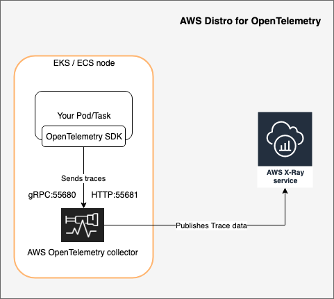
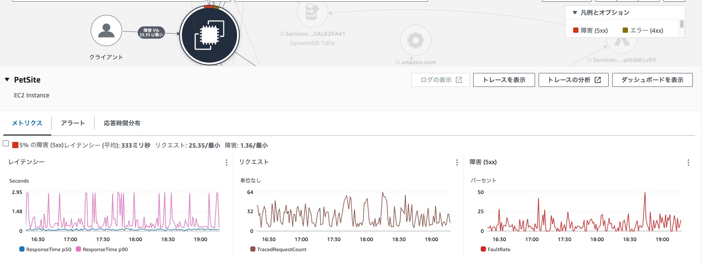
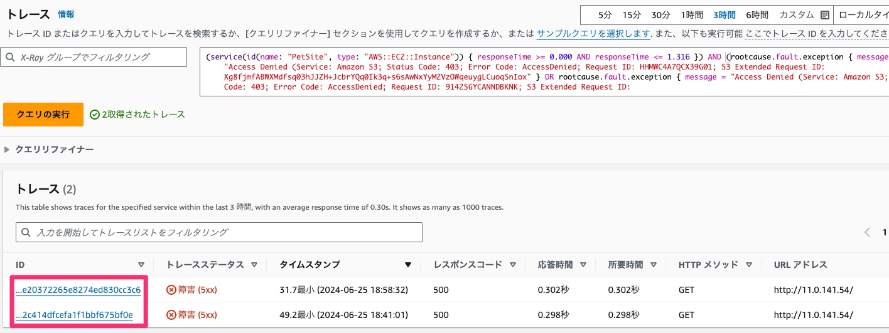
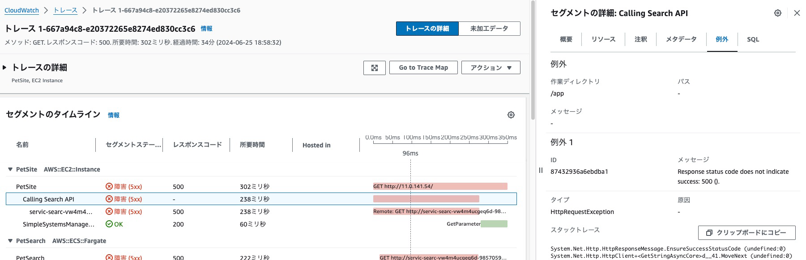

# モニタリングツールの実践

このモジュールでは以下のことを行います。

- トレース取得のための設定
- トレースの確認

## オブザーバビリティとは

オブザーバビリティ（Observability）は、システムの内部状態を外部から観察し、理解する能力のことを指します。これは、特に複雑な分散システムやクラウドネイティブ環境において重要です。  

1. オブザーバビリティの基本要素
    1. オブザーバビリティは主に以下の3つの要素から成り立っています：
        - ログ（Logs）: ログは、システムやアプリケーションが動作中に生成するメッセージの記録です。エラーメッセージやユーザーのアクションの記録などが含まれます。ログは問題が発生した際の詳細な情報を提供し、トラブルシューティングに役立ちます。
        - メトリクス（Metrics）: メトリクスは、システムのパフォーマンスやリソース使用状況を数値化したものです。CPU使用率、メモリ使用量、リクエスト数などが含まれます。メトリクスはシステムの健康状態をリアルタイムで監視するために重要です。
        - トレース（Traces）: トレースは、システム内のリクエストやトランザクションの流れを追跡するものです。特にマイクロサービスアーキテクチャでは、リクエストが複数のサービスを経由するため、トレースによってどこで遅延やエラーが発生しているかを特定できます。

- ログやメトリクスは比較的取得しているシステムは多いかと思いますが、トレースについては取得していないというシステムもあるのではないかと思います。そのため、本日はトレースについて実際に実装を行ってみようと思います

## トレース取得のための設定

- トレースは一般的にはアプリケーションにSDKを入れることで取得します
    - 今回のシステムでいうとECSタスクの中のコンテナで稼働するアプリケーションにSDKを入れます（既に入っています）
        - AWSでトレースを取得するSDKは大きく２つあります
            - Open Telemetry SDK
            - X-Ray SDK
        - 今回はOpen Telemetry SDKを使って以下のような構成でトレースを送ります
            - 

1. 既にOpen Telemetry SDKはアプリケーションに組み込み済みのため、サイドカーコンテナである *AWS Open Telemetry Collector* を追加します
2. タスク定義を書き換えましょう。本ハンズオンでは事前にタスク定義を用意してありますので差し替えるだけです
    1. `ecs-task-def.json`を 差し替えましょう
        1. ```
            # developブランチであることを確認
            git branch
            # 置き換える前に変更箇所を確認してみましょう
            cd Handson_with_Secure_container_operations/contents/module6/
            diff ecs-task-def.json ../../app/ecs-task-def.json
            # タスク定義ファイルの格納
            git mv ecs-task-def.json ../../app/ecs-task-def.json
3.  編集が完了したら、ファイルをGitHubリポジトリにpushします
    1. ```
        # コミットとpush
        git add --all
        git commit -m "add otel collector"
        git push myrepo develop
4. [module4](../module4/module4.md) の手順に従いブラウザ上でdevelopブランチからmainブランチへのプルリクエストを出し、mainブランチへのマージをしてください
5. mainブランチへのマージができたらデプロイは完了です

## トレースの確認

- トレースの表示
    - いずれかの円をクリックするとそのリソースのトレース情報が確認できる
        - 
    - メトリクスタブ：応答時間、リクエスト数、障害(5xx)数の表示
    - アラート：対象リソースに紐づくCloudWatchアラームを表示
    - 応答時間分布：横軸が応答時間、縦軸が全体の何％かを示しており、各応答時間ごとにどのくらいの割合で発生しているかを確認できる
        - 応答時間の範囲をマウスで選択すると対象範囲のトレース情報を表示する「フィルタリングされたトレースの表示」ボタンが出てくる
- トレース詳細
    - 上記、いずれかの円をクリックした際に出てくる「トレースの表示」や「フィルタリングされたトレースの表示」ボタンを押すことでトレース詳細画面に遷移
    - 下記トレースの画面で各トレースIDを選択するとそのトレースの詳細が見れる
        - 
    - そのトレース（１リクエスト）の中で実行されたAPIやDB接続、レスポンスコードや所要時間などを確認可能
    - 例えば、障害(5xx)となっている箇所を選択すると、エラーとなった原因の例外情報が見れる
        - 
